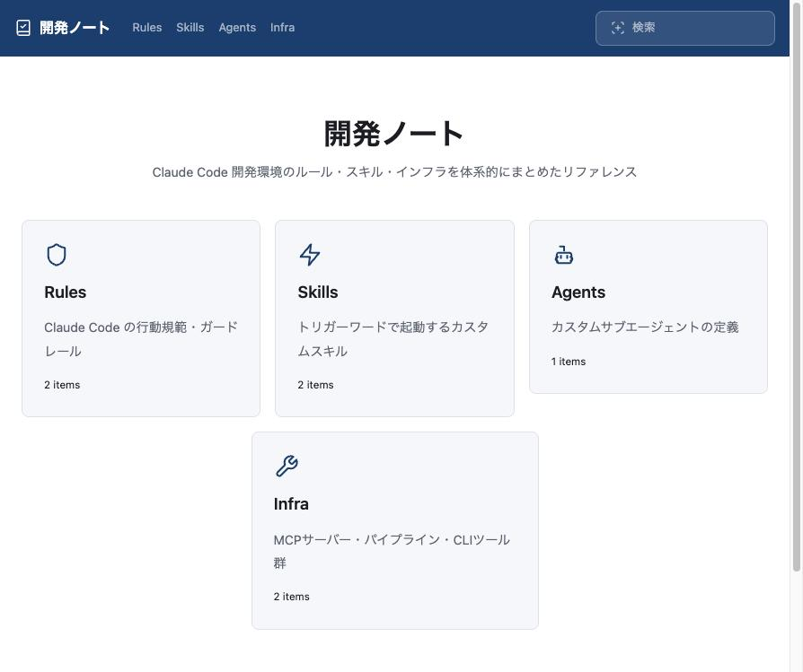
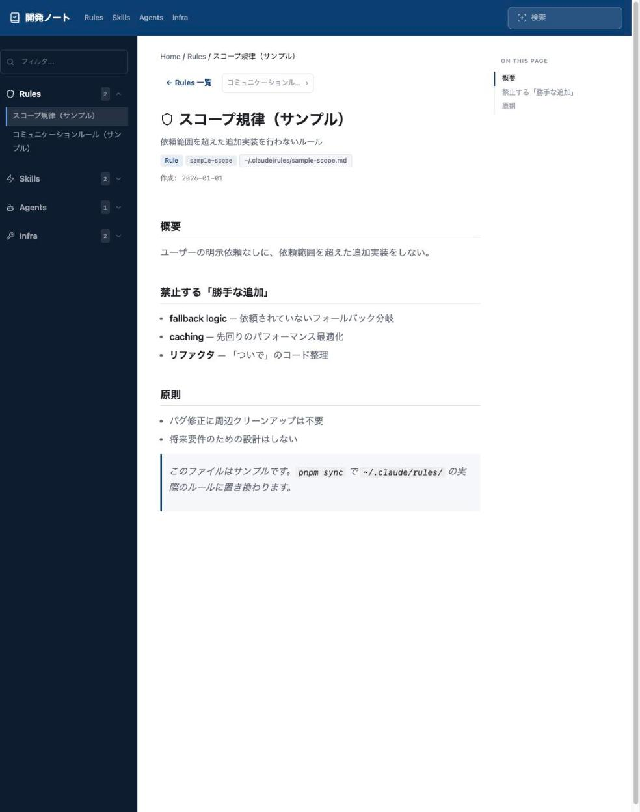
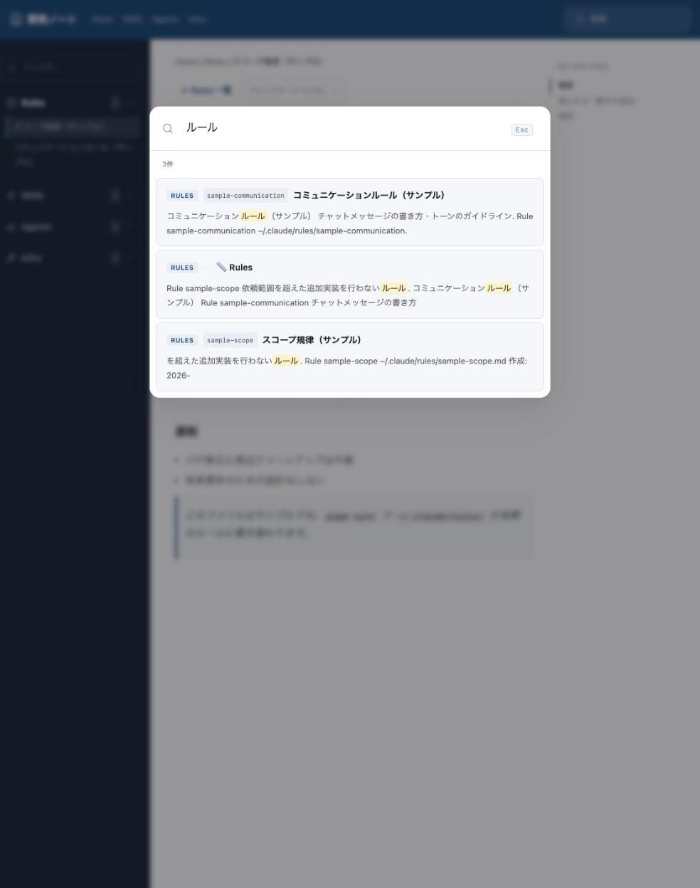
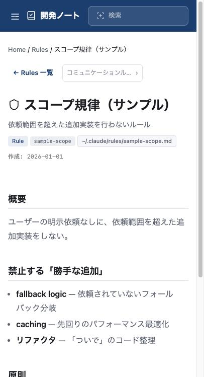
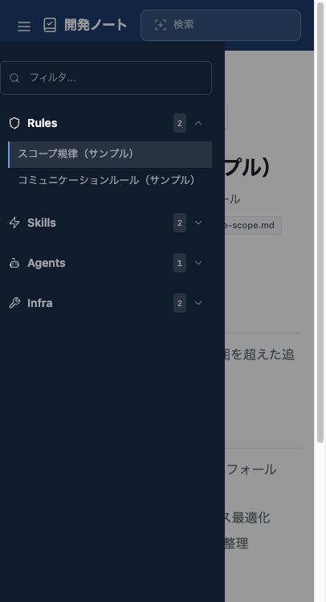

# 開発ノート テンプレート

Claude Code 開発環境のルール・スキル・インフラを体系的にまとめたドキュメントサイトのテンプレート。

## クイックスタート

```bash
# 1. リポジトリをクローン
git clone https://github.com/soyalumno/cc-env-docs-template.git my-dev-notes
cd my-dev-notes

# 2. 依存関係をインストール
pnpm install

# 3. 開発サーバーを起動
pnpm dev
```

`http://localhost:4321` にアクセスすると、サンプルコンテンツが表示されます。

## 自分の環境を同期する

```bash
pnpm sync      # ~/.claude/ からコンテンツを自動同期
pnpm build     # サイトをビルド（検索インデックス含む）
```

同期されるコンテンツ:

| カテゴリ | ソース | 内容 |
|---|---|---|
| Rules | `~/.claude/rules/*.md` | Claude Code の行動規範 |
| Skills | `~/.claude/skills/*/SKILL.md` | カスタムスキル |
| Agents | `~/.claude/agents/*.md` | カスタムサブエージェント |
| Infra | 自動生成 | MCP サーバー・パイプライン・CLI |

## 主な機能

### ホーム — カテゴリ一覧

Rules / Skills / Agents / Infra の4カテゴリをカード形式で一覧表示。各カテゴリの件数も一目で分かります。



### ドキュメント詳細 — 目次・前後ナビ・バッジ

各ドキュメントページには、左サイドバー、右側の見出しジャンプ（ON THIS PAGE）、パンくず、前後ページナビゲーション、カテゴリバッジ、同期元ファイルパスをまとめて表示します。



### 全文検索（Pagefind）

ヘッダーの検索からサイト全体を全文検索。ヒット箇所がハイライト表示されます。



### サイドバーフィルタ

サイドバー上部のフィルタにキーワードを入力すると、一致する項目だけに絞り込めます。


### レスポンシブ対応

モバイル幅ではサイドバーがハンバーガーメニューに収まり、コンテンツが1カラムに再配置されます。

| モバイル表示 | メニュー展開 |
|---|---|
|  |  |

## カスタマイズ

### カラーテーマ

`src/styles/global.css` でカラートークンを変更:

```css
@layer lism-base {
  :root {
    --brand: #0A3F71;
    --accent: #0A3F71;
  }
}
```

ヘッダー・サイドバーの背景色: `src/components/Header.astro`, `Sidebar.astro`

### スキルの除外

`scripts/sync-content.mjs` の `SKILL_EXCLUDES` に追加:

```js
const SKILL_EXCLUDES = new Set(['external-skill-name']);
```

## デプロイ（Cloudflare Workers）

```bash
pnpm add -D wrangler
echo '{"name":"my-dev-notes","compatibility_date":"2025-06-01","assets":{"directory":"./dist"}}' > wrangler.jsonc
pnpm exec wrangler login
pnpm exec wrangler deploy
```

## 技術スタック

- [Astro](https://astro.build/) — 静的サイト生成
- - Lism CSS — レイアウト・コンポーネント
  - - [Pagefind](https://pagefind.app/) — 全文検索
    - 
